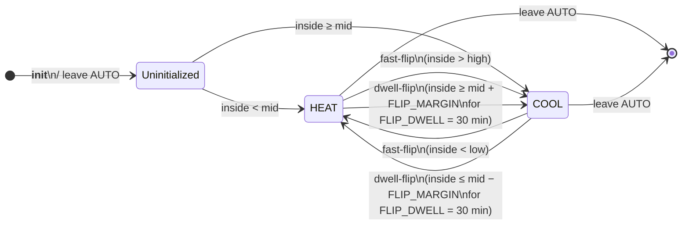

# Smart Climate — AUTO mode state machine

Reference for the AUTO-mode behavior of `climate.smart_climate` as of
**v3.1.0**.  Two layers compose:

1. **Direction commitment** (`_auto_mode`) — sticky HEAT or COOL choice
   that flips on demand mismatch.
2. **Unit command** — the actual mode sent to the wrapped device on each
   sensor tick, derived from the committed direction and current
   temperature.

Other HVAC modes (`OFF`, `HEAT`, `COOL`) pass through to the wrapped
device unchanged; the state machines below only apply when the wrapper
is in `AUTO`.

---

## Layer 1 — Direction commitment

`_auto_mode` is `None` after init / leaving AUTO.  On the first sensor
tick in AUTO it commits to either `HEAT` or `COOL` based on inside-vs-
midpoint of the active comfort band.  Once committed, it flips only on
genuine demand mismatch — by one of two mechanisms:



### Why two flip mechanisms

`FLIP_DWELL = 30 min` is sized for **sensor jitter / natural drift near
the midpoint**.  When inside oscillates around `mid ± FLIP_MARGIN`,
30-minute sustained pressure tells you "this is real demand, not noise".

But the dwell is the wrong filter when inside is **already past the
band edge** — there's no jitter explanation for `inside > high` while
HEAT is committed.  That's a wrong commitment, not noise.  Fast-flip
catches it on the very next sensor tick.

| Mechanism | Trigger | Latency |
|---|---|---|
| **Fast-flip** | Wrong direction + inside past band edge (`HEAT & inside > high`, or `COOL & inside < low`) | Immediate (next sensor tick) |
| **Dwell-flip** | Wrong direction + inside past `mid ± FLIP_MARGIN` but still in band | 30 min sustained excursion |

### Initial-pick rule (`_auto_mode == None`)

Inside-vs-midpoint, full stop.  Outside sensor is **not** consulted —
empirically the outside reading doesn't correlate with the building's
thermodynamics in this deployment, and using it caused live HEAT-at-23
bugs (see [PR #62](https://github.com/HomeOps/HASS-Smart-Climate/pull/62)).
Outside sensor remains a valid config option for display / future use.

---

## Layer 2 — Unit command (per-tick decision)

Given a committed direction and the current inside temperature, what
mode does the wrapper send to the wrapped device?

### `_auto_mode == HEAT`

Always **`HEAT`**.  v2.0.0 contract preserved: on this Midea inverter
the unit modulates HEAT down to a true compressor idle when no demand,
so commanding OFF (and absorbing the start-up cost on the next call
for heat) costs more than just letting it sit.

### `_auto_mode == COOL`

Asymmetric — the in-band hysteresis is what stops the COOL minimum-
frequency floor from pumping unwanted cold air:

```mermaid
flowchart TD
    Start([inside, _auto_mode = COOL]) --> AboveBand{inside &gt; high<br/>or inside &lt; low?}
    AboveBand -->|Yes,<br/>real demand| RunCool[Send <b>COOL</b>]
    AboveBand -->|No, in band| WasCool{Last command<br/>was COOL?}
    WasCool -->|Yes| AboveMid{inside &gt; mid?}
    AboveMid -->|Yes,<br/>keep cooling| RunCool
    AboveMid -->|No,<br/>full pull achieved| RunOff[Send <b>OFF</b><br/><i>(deliberate-OFF)</i>]
    WasCool -->|No / None| AboveRestart{inside &gt; mid<br/>+ COOL_RESTART_OFFSET?}
    AboveRestart -->|Yes,<br/>start next pull| RunCool
    AboveRestart -->|No,<br/>stay quiet| RunOff
```

### Why hysteresis

Without asymmetric thresholds, the wrapper short-cycles at the band
edge: temp hits `high`, COOL runs briefly, temp drops 0.1 °C, OFF
fires.  The cycle does no useful cooling and wastes compressor starts.

The fix uses two thresholds keyed on the wrapper's last command:

| State | Restart at | Stop at | Per-cycle pull |
|---|---|---|---|
| Last was COOL | (already cooling) | `inside ≤ mid` | `mid + RESTART_OFFSET → mid` |
| Last was OFF / None | `inside > mid + RESTART_OFFSET` | (already off) | (waits for restart trigger) |

For the default home preset (`[21, 23]`, `mid = 22`,
`COOL_RESTART_OFFSET = 0.75`):

```
   COOL      ░░░░░░░░░░░░░░░░░░░░░░░░░ ← mid + RESTART_OFFSET = 22.75
                                          (restart threshold)
                                          ┌── 0.25 °C lag headroom
                                          │
   ════════════════════════════════════ ← high = 23
                                          │
                                          └── room must NOT exceed
                                              this in steady state
   COOL      ░░░░░░░░░░░░░░░░░░░░░░░░░ ← mid = 22 (stop threshold)
   pulse:    ┃         ┃    ↑
             stop      restart
             (mid)     (mid + 0.75)
```

The 0.25 °C between the restart threshold (22.75) and the high edge
(23) is the unit's **response-lag headroom** — compressor ramp + air
circulation time.  By the time current would otherwise hit 23, COOL
flow is already pulling the room down.

> **Requires a sub-degree (decimal) inside-temp sensor.**  A whole-
> degree sensor jumps `22 → 23` and skips the 22.75 threshold,
> defeating the lead.  This deployment uses Aeotec Multisensor 7
> (0.1 °C resolution).  For coarser sensors, raise
> `COOL_RESTART_OFFSET` to at least `(sensor_resolution + 0.5 °C)`.

### Why HEAT doesn't need the same hysteresis

The Midea unit modulates HEAT down to a true compressor idle when no
demand — likely because in HEAT the indoor coil is the hot side, so
refrigerant migrates outdoors when stopped (benign, no slug-on-restart
risk).  COOL inverts that geometry, so the firmware holds a minimum
frequency to prevent slugging.  The wrapper provides the idle the unit
won't, but only where it's needed.

See [`CLAUDE.md`](../CLAUDE.md#why-the-asymmetry-exists-refined-theory)
for the refined theory and the design history.

---

## Composing the layers

Per sensor tick:

1. If `_auto_mode is None`: pick HEAT or COOL by inside-vs-mid.
2. **Fast-flip check**: if committed direction is wrong AND inside is
   past the band edge, flip `_auto_mode` immediately.
3. **Dwell-flip check**: update `_pending_flip_since` based on `mid ±
   FLIP_MARGIN` deviation; flip `_auto_mode` if sustained for 30 min.
4. **Unit command**: derive HEAT / COOL / OFF from the (possibly just-
   flipped) `_auto_mode` per Layer 2.
5. **Send to device**: only call `set_temperature` / `set_hvac_mode`
   when the unit's reported state differs from the desired one.

The wrapper exposes its decision via `hvac_action`:

| Wrapper state | `hvac_action` |
|---|---|
| Active mode → unit reports `cooling` / `heating` | mirrors the unit |
| AUTO + COOL committed + in-band → unit OFF | **`idle`** (deliberate-OFF) |
| User-commanded OFF | `off` |

---

## Problem detection (`problems` attribute)

The wrapper continuously checks for failure modes the state machine
itself can't fix.  See [`CLAUDE.md` → Problem detection](../CLAUDE.md#problem-detection-problems-attribute)
for the conditions and thresholds.

`problems` is a list of short codes — empty `[]` when healthy, e.g.
`["out_of_band:42min", "short_cycle:8/h"]` when not.  Templates can
key off `length > 0` for notifications.

---

## Constants

All thresholds live in [`const.py`](../custom_components/smart_climate/const.py):

| Constant | Default | Purpose |
|---|---|---|
| `FLIP_MARGIN` | 0.5 °C | Past midpoint to count as wrong-side |
| `FLIP_DWELL` | 1800 s (30 min) | Sustained-excursion threshold for dwell-flip |
| `COOL_RESTART_OFFSET` | 0.75 °C | Above mid where COOL restarts (lead the high edge) |
| `OUT_OF_BAND_ALERT_MINUTES` | 30 | When AUTO can't keep room in band |
| `SHORT_CYCLE_THRESHOLD_PER_H` | 6 | COOL starts/h above this is a problem |
| `SENSOR_STALE_MINUTES` | 15 | Inside-sensor freshness threshold |
